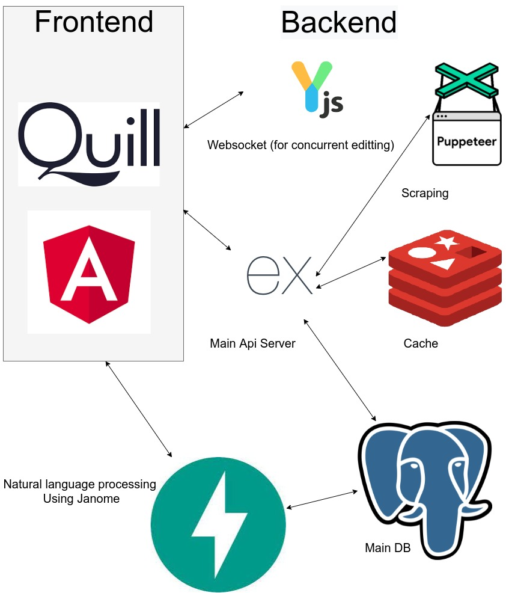

# Pop idle text editor

This application is used for creating videos. It is used for manuscript creation, subtitle generation, etc.
Dark mode is also supported.



## Dependencies

- Python 3.7.5
- Node v12.22.1
- PostgreSQL 12.8
- Redis server v=5.0.6

## Steps to run this project:

### 1. install packages

```sh
# frontend
cd frontend && npm install
# backend
npm i
# nlp_backend
cd nlp_backend && pip install -r requirements/dev.txt
```

### 2. Setup settings inside `env.json` file refering to `env_template.json`

### 3. Run commands

```sh
# frontend
cd frontend && npm start
# backend
npm start
# nlp_backend
cd nlp_backend && uvicorn main:app --reload
# websocket server
npx y-websocket-server
```

## Usage

### '/home'

This page contains news and tweets from the "坂道" group.

### '/members'

This page contains information about the members of "坂道" Group.

### '/google-search'

This page is to select a member of the "坂道" group and run a search by including that site in the google query query.

### '/scripts'

This page is for creating a manuscript. Multiple people can edit it at the same time. There is also a function to proofread sentences using `textlint`, and a function to link sentences to chat messages.　 Histories of the text is created based on time and the magnitude of the changes.

### '/subtitle'

This page is for converting your manuscript. This page contains functions for converting your manuscript into text for use in the software "Softalk", as well as converting it into the SRT format used for subtitles. It uses "Janome" to convert the text, and has the ability to register it in a user dictionary.
